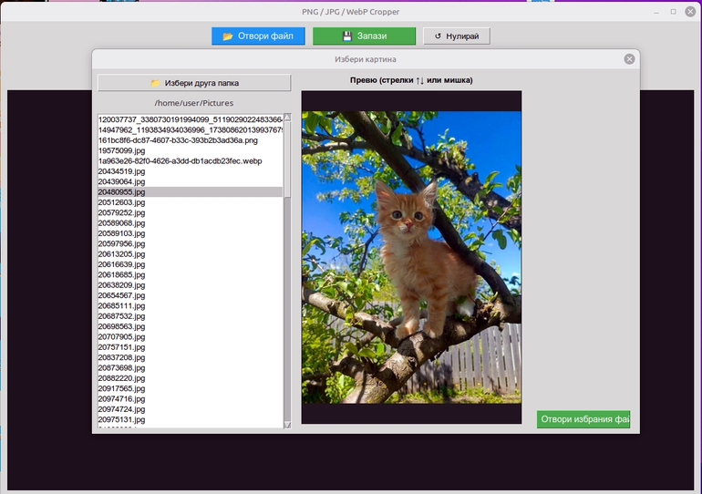
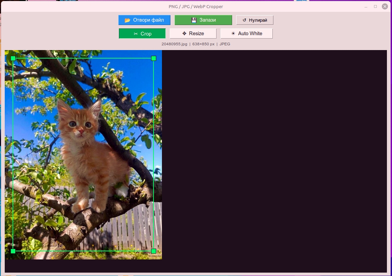
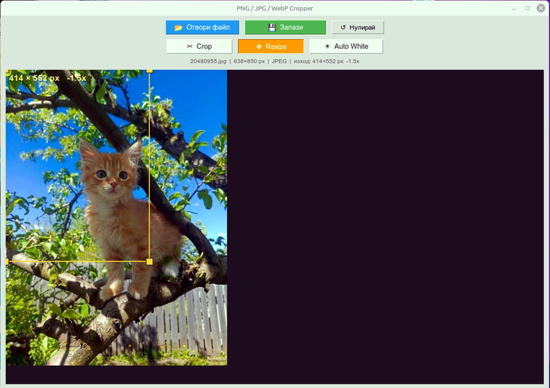
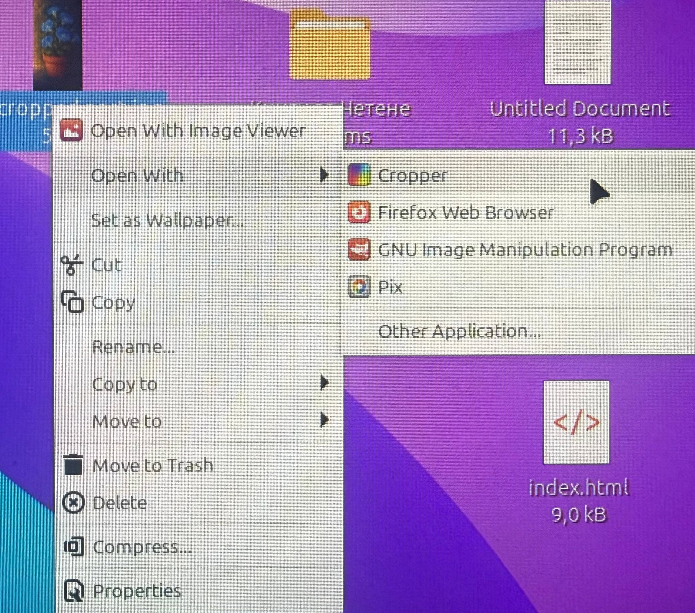

# Image Cropper

[](https://www.python.org/)
[](https://docs.python.org/3/library/tkinter.html)
[](https://pypi.org/project/Pillow/)
[](#installation)
[](#installation)
[](https://linuxmint.com/)
[](#installation)
[](#installation)
[](#installation)
[](#add-to-open-with-context-menu)
[](#image-cropper)
[](#image-cropper)
[](#image-cropper)
[](#crop)
[](#resize)
[](#auto-white)
[](#image-cropper)
[](#image-cropper)
[](#image-cropper)
[](#add-to-open-with-context-menu)
[](#image-cropper)
[](#image-cropper)
[](#image-cropper)
[](#license)
[](#license)
[](#license)
[](#license)

Simple **PNG, JPG and WebP** cropper / resizer for Linux Mint 22.2.

Open an image, then pick a tool. The green crop box no longer appears by itself — you choose the mode after the file is loaded.

| # | File name | What to photograph |
| --- | --- | --- |
| 1 | `start_screen.jpg` | First screen after opening an image — Crop / Resize / Auto White visible, no crop box yet |
| 2 | `crop_tool.jpg` | Crop mode — green rectangle and corner handles |
| 3 | `resize_tool.jpg` | Resize mode — yellow box, live `W×H` and scale (`+1.7x` / `-3.6x`) |
| 4 | `auto_white.jpg` | After Auto White — lifted whites, same gain on all colors |

A built-in file browser shows thumbnails. You can also **right-click an image → Open with Cropper**.

---

## Tools



### Crop



Press **Crop**. A green rectangle appears. Drag inside to move it. Drag edges or corners to change the cut. Save writes only that region.

### Resize



Press **Resize**. Aspect ratio stays locked: change the vertical side and the horizontal side follows (and the other way around). The overlay shows output size and scale versus the original:

- larger than original → `+1.7x`
- same size → `+1.0x`
- smaller than original → `-3.6x` (how many times smaller)

Save writes the image at that pixel size (LANCZOS). The yellow box may grow past the preview for upscaling.

### Auto White

Press **Auto White**. The brightest channel in the picture is stretched to pure white (255). Every other color is multiplied by the **same** gain. Alpha is kept. If the image already reaches 255, nothing is changed.

**Нулирай** restores the file as loaded and clears Auto White / the current box.

You can run Auto White first, then Crop or Resize. Save uses the current tool.

---

## Installation

1. Put `cropper.py` in your **HOME** directory.
2. Right-click `cropper.py` → **Properties → Permissions** → check all **Execute** boxes.
3. There are two different `.desktop` files:
   - **File 1:** `cropper.desktop`  
     → Put this one on your **Desktop**  
     → Right-click → **Properties → Permissions** → check all **Execute** boxes
4. Open Terminal and run:

```bash
sudo apt install python3-pillow
sudo apt install python3-pil.imagetk
```

If you get an error, swap them:

```bash
sudo apt install python3-pil.imagetk
sudo apt install python3-pillow
```

or:

```bash
sudo apt install python3-pil python3-pil.imagetk
```

If the window never opens, also install Tk:

```bash
sudo apt install python3-tk
```

That's it. You can now use the program from the Desktop shortcut.

From a terminal:

```bash
python3 "$HOME/cropper.py"
python3 "$HOME/cropper.py" /path/to/picture.png
```

If startup fails, the app writes `~/cropper_error.log`.

---

## Add to “Open With” context menu



1. Go to your Home folder.
2. Right-click on empty space → check **Show Hidden Files**.
3. Go to `.local/share/applications`.
4. There are two different `.desktop` files:
   - **File 2:** `cropper-openwith.desktop`  
     → this one is for the context menu (“Open with”)
5. Cut/Paste `cropper-openwith.desktop` into that folder.
6. Rename it to `cropper.desktop`  
   → Right-click → **Properties → Permissions** → check all **Execute** boxes
7. Open Terminal and run:

```bash
chmod +x ~/.local/share/applications/cropper.desktop
update-desktop-database ~/.local/share/applications/
```

Done. Now when you right-click on any image you will see **Open with Cropper**.

---

## What it does

| Action | How |
| --- | --- |
| Open | Built-in browser (`~/Desktop` first) — arrows or mouse, then Open |
| Crop | Green box after you press **Crop**; corners and edges resize; inside moves it |
| Resize | Yellow box after you press **Resize**; aspect stays locked; shows `W×H` and `+1.7x` / `-3.6x` |
| Auto White | Brightest channel → 255; same multiplier on all colors |
| Reset | `Нулирай` restores the original image and selection |
| Save | PNG / JPEG / WebP via the save dialog |

Save quality:

- **JPEG** — `quality=100`, no chroma subsampling
- **WebP** — lossless if the image has transparency, otherwise quality 100
- **PNG** — `compress_level=0` (largest, no extra generation loss)

JPEG cannot keep transparency; RGBA images are converted to RGB before `.jpg` save.

---

## License

**Forever Free** for use by everyone: private and/or public and/or business.

You are free to use it as it is or change anything you want depending on your whims.

Any issues, questions, or if you are too lazy to do the changes yourself:

**good.vibes.github@gmail.com**
